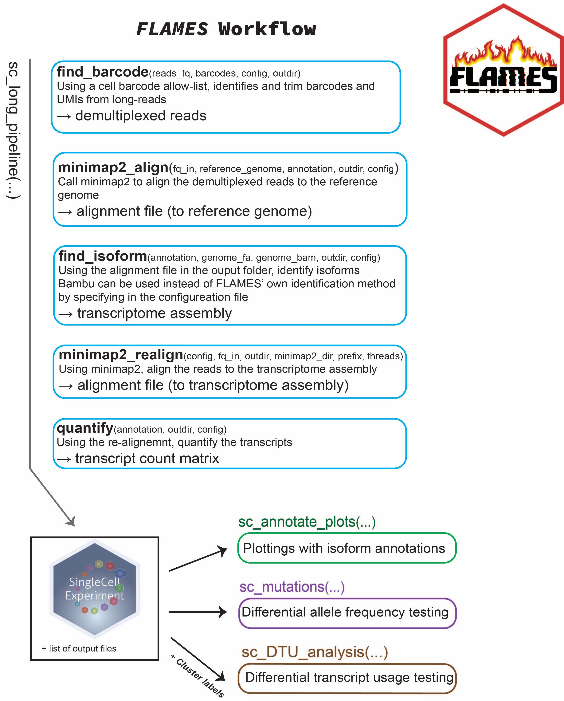

# FLAMES


The FLAMES package provides a framework for performing single-cell and bulk read full-length analysis of mutations and splicing. FLAMES performs cell barcode and UMI assignment from nanopore reads as well as semi-supervised isoform detection and quantification. FLAMES is designed to be an easy and quick to use, powerful workflow for isoform detection and quantification, splicing analysis and mutation detection.

Currently, FLAMES can be installed through R by using:
```
if (!requireNamespace("devtools", quietly=TRUE)) {
    install.packages("devtools")
}
library(devtools)
install_github("OliverVoogd/FLAMES")
```

Input to FLAMES are fastq files generated from the long-read platform. Using the cell barcode annotation obtained from short-read data as the reference, the pipeline identifies and trims cell barcodes/UMI sequences from the long reads. After barcode assignment, all reads are aligned to the relevant genome to obtain a draft read alignment. The draft alignment is then polished and grouped to generate a consensus transcript assembly. All reads are aligned again using the transcript assembly as the reference and quantified. 



The above figure provides a high level overview of the main steps in the FLAMES pipeline. The optional arguments on the left are colour coded to associate with the specific step that they apply to.

The FLAMES vignette can be found using:
```
# FLAMES must be installed
browseVignettes("FLAMES")
```