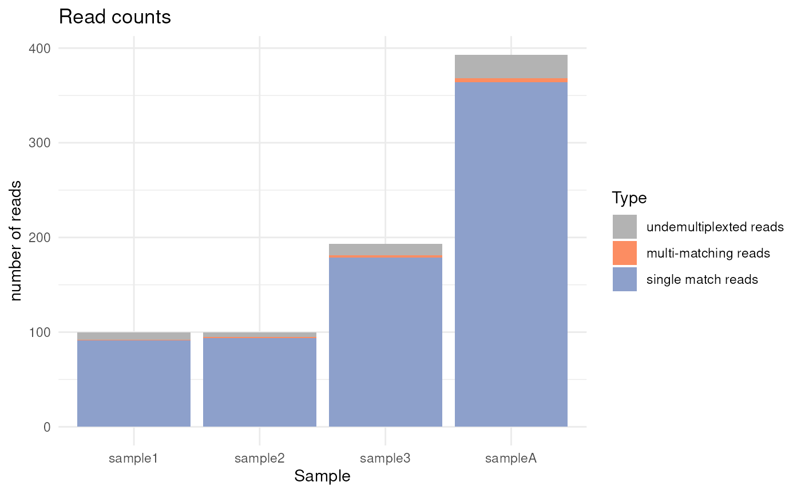
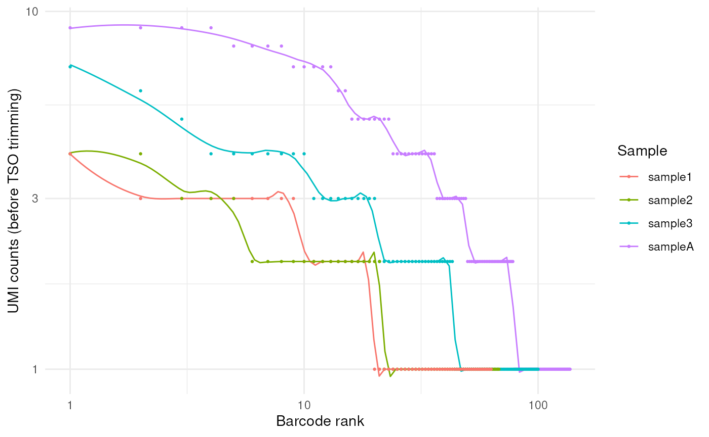
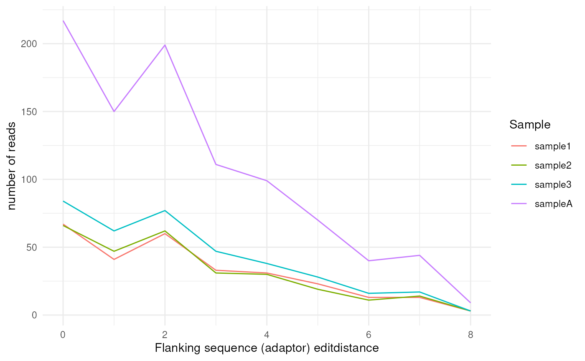
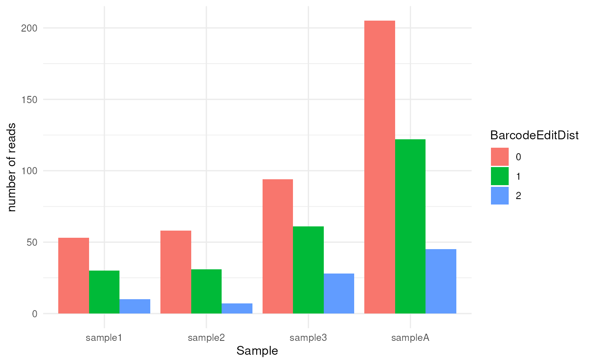

# FLAMES 2.3.1

## FLAMES

The overhauled FLAMES 2.3.1 pipeline provides convenient pipelines for
performing single-cell and bulk long-read analysis of mutations and
isoforms. The pipeline is designed to take various type of experiments,
e.g. with or without known cell barcodes and custome cell barcode
designs, to reduce the need of constantly re-inventing the wheel for
every new sequencing protocol.


(#fig:workflow) FLAMES pipeline

### Creating a pipeline

To start your long-read RNA-seq analysis, simply create a pipeline via
either
[`BulkPipeline()`](https://mritchielab.github.io/FLAMES/reference/BulkPipeline.md),
[`SingleCellPipeline()`](https://mritchielab.github.io/FLAMES/reference/SingleCellPipeline.md)
or
[`MultiSampleSCPipeline()`](https://mritchielab.github.io/FLAMES/reference/MultiSampleSCPipeline.md).
Let’s try
[`SingleCellPipeline()`](https://mritchielab.github.io/FLAMES/reference/SingleCellPipeline.md)
first:

``` r

outdir <- tempfile()
dir.create(outdir)
# some example data
# known cell barcodes, e.g. from coupled short-read sequencing
bc_allow <- file.path(outdir, "bc_allow.tsv")
R.utils::gunzip(
  filename = system.file("extdata", "bc_allow.tsv.gz", package = "FLAMES"),
  destname = bc_allow, remove = FALSE
)
# reference genome
genome_fa <- file.path(outdir, "rps24.fa")
R.utils::gunzip(
  filename = system.file("extdata", "rps24.fa.gz", package = "FLAMES"),
  destname = genome_fa, remove = FALSE
)

pipeline <- SingleCellPipeline(
  # use the default configs
  config_file = create_config(
    outdir,
    pipeline_parameters.demultiplexer = "flexiplex"
  ),
  outdir = outdir,
  # the input fastq file
  fastq = system.file("extdata", "fastq", "musc_rps24.fastq.gz", package = "FLAMES"),
  # reference annotation file
  annotation = system.file("extdata", "rps24.gtf.gz", package = "FLAMES"),
  genome_fa = genome_fa,
  barcodes_file = bc_allow
)
#> ℹ Writing configuration to: /tmp/RtmpfFCfUB/fileca012f1d64b/config_file_51713.json
#> Configured steps: 
#>  barcode_demultiplex: TRUE
#>  genome_alignment: TRUE
#>  gene_quantification: TRUE
#>  isoform_identification: TRUE
#>  read_realignment: TRUE
#>  transcript_quantification: TRUE
#> samtools not found, will use Rsamtools package instead
pipeline
#> → A FLAMES.SingleCellPipeline outputting to /tmp/RtmpfFCfUB/fileca012f1d64b
#> 
#> ── Inputs
#> ✔ fastq: ...ibrary/FLAMES/extdata/fastq/musc_rps24.fastq.gz
#> ✔ annotation: /__w/_temp/Library/FLAMES/extdata/rps24.gtf.gz
#> ✔ genome_fa: /tmp/RtmpfFCfUB/fileca012f1d64b/rps24.fa
#> ✔ barcodes_file: /tmp/RtmpfFCfUB/fileca012f1d64b/bc_allow.tsv
#> 
#> ── Outputs
#> ℹ demultiplexed_fastq: matched_reads.fastq.gz
#> ℹ deduped_fastq: matched_reads_dedup.fastq.gz
#> ℹ genome_bam: align2genome.bam
#> ℹ transcriptome_assembly: transcript_assembly.fa
#> ℹ transcriptome_bam: realign2transcript.bam
#> 
#> ── Pipeline Steps
#> ℹ barcode_demultiplex (pending)
#> ℹ genome_alignment (pending)
#> ℹ gene_quantification (pending)
#> ℹ isoform_identification (pending)
#> ℹ read_realignment (pending)
#> ℹ transcript_quantification (pending)
```

### Running the pipeline

To execute the pipeline, simply call `run_FLAMES(pipeline)`. This will
run through all the steps in the pipeline, returning a updated pipeline
object:

``` r

pipeline <- run_FLAMES(pipeline)
#> ── Running step: barcode_demultiplex @ Fri Jun 26 08:26:13 2026 ────────────────
#> Using flexiplex for barcode demultiplexing.
#> Loading known barcodes from /tmp/RtmpfFCfUB/fileca012f1d64b/bc_allow.tsv
#> Number of known barcodes: 143
#> FLEXIPLEX 1.02.6
#> Setting max flanking sequence edit distance to 8
#> Setting number of threads to 8
#> Search pattern:
#> primer: CTACACGACGCTCTTCCGATCT
#> CB: NNNNNNNNNNNNNNNN
#> UB: NNNNNNNNNNNN
#> polyT: TTTTTTTTT
#> CB:Z: tag field: CB
#> Processing file: /__w/_temp/Library/FLAMES/extdata/fastq/musc_rps24.fastq.gz
#> Searching for barcodes...
#> Number of reads processed: 393
#> Number of reads where at least one barcode was found: 368
#> Number of chimera reads: 1
#> All done!
#> Reads    Barcodes
#> 10   2
#> 9    2
#> 8    5
#> 7    4
#> 6    3
#> 5    7
#> 4    14
#> 3    14
#> 2    29
#> 1    57
#> ── Running step: genome_alignment @ Fri Jun 26 08:26:15 2026 ───────────────────
#> Creating junction bed file from GFF3 annotation.
#> Aligning sample /tmp/RtmpfFCfUB/fileca012f1d64b/matched_reads.fastq.gz -> /tmp/RtmpfFCfUB/fileca012f1d64b/align2genome.bam
#> Warning in minimap2_align(fq_in = fastqs[i], fa_file = genome, config =
#> pipeline@config, : samtools not found, using Rsamtools instead, this could be
#> slower and might fail for large BAM files.
#> Sorting BAM files by genome coordinates with 8 threads...
#> Indexing bam files
#> ── Running step: gene_quantification @ Fri Jun 26 08:26:15 2026 ────────────────
#> 08:26:15 AM Fri Jun 26 2026 quantify genes
#> Using BAM(s): /tmp/RtmpfFCfUB/fileca012f1d64b/align2genome.bam
#> Assigning reads to genes...
#> Writing the gene count matrix ...
#> Plotting the saturation curve ...
#> Generating deduplicated fastq file ...
#> ── Running step: isoform_identification @ Fri Jun 26 08:26:16 2026 ─────────────
#> #### Read gene annotations
#>  Removed similar transcripts in gene annotation: Counter()
#> #### find isoforms
#> chr14
#> ── Running step: read_realignment @ Fri Jun 26 08:26:17 2026 ───────────────────
#> Checking for fastq file(s) /__w/_temp/Library/FLAMES/extdata/fastq/musc_rps24.fastq.gz
#>  files found
#> Checking for fastq file(s) /tmp/RtmpfFCfUB/fileca012f1d64b/matched_reads.fastq.gz
#>  files found
#> Checking for fastq file(s) /tmp/RtmpfFCfUB/fileca012f1d64b/matched_reads_dedup.fastq.gz
#>  files found
#> Realigning sample /tmp/RtmpfFCfUB/fileca012f1d64b/matched_reads_dedup.fastq.gz -> /tmp/RtmpfFCfUB/fileca012f1d64b/realign2transcript.bam
#> Warning in minimap2_align(fq_in = fastqs[i], fa_file =
#> pipeline@transcriptome_assembly, : samtools not found, using Rsamtools instead,
#> this could be slower and might fail for large BAM files.
#> Sorting BAM files by 8 with CB threads...
#> ── Running step: transcript_quantification @ Fri Jun 26 08:26:17 2026 ──────────
pipeline
#> ✔ A FLAMES.SingleCellPipeline outputting to /tmp/RtmpfFCfUB/fileca012f1d64b
#> 
#> ── Inputs
#> ✔ fastq: ...ibrary/FLAMES/extdata/fastq/musc_rps24.fastq.gz
#> ✔ annotation: /__w/_temp/Library/FLAMES/extdata/rps24.gtf.gz
#> ✔ genome_fa: /tmp/RtmpfFCfUB/fileca012f1d64b/rps24.fa
#> ✔ barcodes_file: /tmp/RtmpfFCfUB/fileca012f1d64b/bc_allow.tsv
#> 
#> ── Outputs
#> ✔ demultiplexed_fastq: matched_reads.fastq.gz [219.7 KB]
#> ✔ deduped_fastq: matched_reads_dedup.fastq.gz [206.0 KB]
#> ✔ genome_bam: align2genome.bam [273.5 KB]
#> ✔ novel_isoform_annotation: isoform_annotated.gff3 [7.4 KB]
#> ✔ transcriptome_assembly: transcript_assembly.fa [8.4 KB]
#> ✔ transcriptome_bam: realign2transcript.bam [396.0 KB]
#> 
#> ── Pipeline Steps
#> ✔ barcode_demultiplex (completed in 1.33 sec)
#> ✔ genome_alignment (completed in 0.36 sec)
#> ✔ gene_quantification (completed in 0.99 sec)
#> ✔ isoform_identification (completed in 0.51 sec)
#> ✔ read_realignment (completed in 0.26 sec)
#> ✔ transcript_quantification (completed in 0.58 sec)
```

If you run into any error,
[`run_FLAMES()`](https://mritchielab.github.io/FLAMES/reference/run_FLAMES.md)
will stop and return the pipeline object with the error message. After
resolving the error, you can run `resume_FLAMES(pipeline)` to continue
the pipeline from the last step. There is also
`run_step(pipeline, step_name)` to run a specific step in the pipeline.
Let’s show this by deliberately causing an error via deleting the input
files:

``` r

# set up a new pipeline
outdir2 <- tempfile()
pipeline2 <- SingleCellPipeline(
  config_file = create_config(
    outdir,
    pipeline_parameters.demultiplexer = "flexiplex"
  ),
  outdir = outdir2,
  fastq = system.file("extdata", "fastq", "musc_rps24.fastq.gz", package = "FLAMES"),
  annotation = system.file("extdata", "rps24.gtf.gz", package = "FLAMES"),
  genome_fa = genome_fa,
  barcodes_file = bc_allow
)
#> ℹ Output directory does not exist, creating: /tmp/RtmpfFCfUB/fileca01598ff9c0
#> ℹ Writing configuration to: /tmp/RtmpfFCfUB/fileca012f1d64b/config_file_51713.json
#> Configured steps: 
#>  barcode_demultiplex: TRUE
#>  genome_alignment: TRUE
#>  gene_quantification: TRUE
#>  isoform_identification: TRUE
#>  read_realignment: TRUE
#>  transcript_quantification: TRUE
#> samtools not found, will use Rsamtools package instead

# delete the reference genome
unlink(genome_fa)
pipeline2 <- run_FLAMES(pipeline2)
#> ── Running step: barcode_demultiplex @ Fri Jun 26 08:26:18 2026 ────────────────
#> Using flexiplex for barcode demultiplexing.
#> Loading known barcodes from /tmp/RtmpfFCfUB/fileca012f1d64b/bc_allow.tsv
#> Number of known barcodes: 143
#> FLEXIPLEX 1.02.6
#> Setting max flanking sequence edit distance to 8
#> Setting number of threads to 8
#> Search pattern:
#> primer: CTACACGACGCTCTTCCGATCT
#> CB: NNNNNNNNNNNNNNNN
#> UB: NNNNNNNNNNNN
#> polyT: TTTTTTTTT
#> CB:Z: tag field: CB
#> Processing file: /__w/_temp/Library/FLAMES/extdata/fastq/musc_rps24.fastq.gz
#> Searching for barcodes...
#> Number of reads processed: 393
#> Number of reads where at least one barcode was found: 368
#> Number of chimera reads: 1
#> All done!
#> Reads    Barcodes
#> 10   2
#> 9    2
#> 8    5
#> 7    4
#> 6    3
#> 5    7
#> 4    14
#> 3    14
#> 2    29
#> 1    57
#> ── Running step: genome_alignment @ Fri Jun 26 08:26:18 2026 ───────────────────
#> Creating junction bed file from GFF3 annotation.
#> Aligning sample /tmp/RtmpfFCfUB/fileca01598ff9c0/matched_reads.fastq.gz -> /tmp/RtmpfFCfUB/fileca01598ff9c0/align2genome.bam
#> Warning in minimap2_align(fq_in = fastqs[i], fa_file = genome, config =
#> pipeline@config, : samtools not found, using Rsamtools instead, this could be
#> slower and might fail for large BAM files.
#> Warning in check_status_code(minimap2_status, cmd, "Minimap2"):
#> "'/__w/_temp/Library/FLAMES/bin/minimap2' '-ax' 'splice' '-k14'
#> '--secondary=no' '-t' '8' '--seed' '2022' '-y' '--junc-bed'
#> '/tmp/RtmpfFCfUB/fileca01598ff9c0/reference.bed' '--junc-bonus' '1'
#> '/tmp/RtmpfFCfUB/fileca012f1d64b/rps24.fa'
#> '/tmp/RtmpfFCfUB/fileca01598ff9c0/matched_reads.fastq.gz' >
#> '/tmp/RtmpfFCfUB/fileca01598ff9c0/fileca017b21564b.sam'" exited with status
#> code 1.
#> Warning in value[[3L]](cond): Error in step genome_alignment: argument "no" is
#> missing, with no default, pipeline stopped.
pipeline2
#> ! A FLAMES.SingleCellPipeline outputting to /tmp/RtmpfFCfUB/fileca01598ff9c0
#> 
#> ── Inputs
#> ✔ fastq: ...ibrary/FLAMES/extdata/fastq/musc_rps24.fastq.gz
#> ✔ annotation: /__w/_temp/Library/FLAMES/extdata/rps24.gtf.gz
#> ! genome_fa: /tmp/RtmpfFCfUB/fileca012f1d64b/rps24.fa [missing]
#> ✔ barcodes_file: /tmp/RtmpfFCfUB/fileca012f1d64b/bc_allow.tsv
#> 
#> ── Outputs
#> ✔ demultiplexed_fastq: matched_reads.fastq.gz [219.7 KB]
#> ℹ deduped_fastq: matched_reads_dedup.fastq.gz
#> ℹ genome_bam: align2genome.bam
#> ℹ transcriptome_assembly: transcript_assembly.fa
#> ℹ transcriptome_bam: realign2transcript.bam
#> 
#> ── Pipeline Steps
#> ✔ barcode_demultiplex (completed in 0.19 sec)
#> ✖ genome_alignment (failed: Error in ifelse(status_code == 137, "This is likely due to running out of memory."): argument "no" is missing, with no default
#> )
#> ℹ gene_quantification (pending)
#> ℹ isoform_identification (pending)
#> ℹ read_realignment (pending)
#> ℹ transcript_quantification (pending)
```

Let’s then fix the error by re-creating the reference genome file and
resume the pipeline:

``` r

R.utils::gunzip(
  filename = system.file("extdata", "rps24.fa.gz", package = "FLAMES"),
  destname = genome_fa, remove = FALSE
)
pipeline2 <- resume_FLAMES(pipeline2)
#> Resuming pipeline from step: genome_alignment
#> ── Running step: genome_alignment @ Fri Jun 26 08:26:18 2026 ───────────────────
#> Aligning sample /tmp/RtmpfFCfUB/fileca01598ff9c0/matched_reads.fastq.gz -> /tmp/RtmpfFCfUB/fileca01598ff9c0/align2genome.bam
#> Warning in minimap2_align(fq_in = fastqs[i], fa_file = genome, config =
#> pipeline@config, : samtools not found, using Rsamtools instead, this could be
#> slower and might fail for large BAM files.
#> Sorting BAM files by genome coordinates with 8 threads...
#> Indexing bam files
#> ── Running step: gene_quantification @ Fri Jun 26 08:26:19 2026 ────────────────
#> 08:26:19 AM Fri Jun 26 2026 quantify genes
#> Using BAM(s): /tmp/RtmpfFCfUB/fileca01598ff9c0/align2genome.bam
#> Assigning reads to genes...
#> Writing the gene count matrix ...
#> Plotting the saturation curve ...
#> Generating deduplicated fastq file ...
#> ── Running step: isoform_identification @ Fri Jun 26 08:26:19 2026 ─────────────
#> #### Read gene annotations
#>  Removed similar transcripts in gene annotation: Counter()
#> #### find isoforms
#> chr14
#> ── Running step: read_realignment @ Fri Jun 26 08:26:19 2026 ───────────────────
#> Checking for fastq file(s) /__w/_temp/Library/FLAMES/extdata/fastq/musc_rps24.fastq.gz
#>  files found
#> Checking for fastq file(s) /tmp/RtmpfFCfUB/fileca01598ff9c0/matched_reads.fastq.gz
#>  files found
#> Checking for fastq file(s) /tmp/RtmpfFCfUB/fileca01598ff9c0/matched_reads_dedup.fastq.gz
#>  files found
#> Realigning sample /tmp/RtmpfFCfUB/fileca01598ff9c0/matched_reads_dedup.fastq.gz -> /tmp/RtmpfFCfUB/fileca01598ff9c0/realign2transcript.bam
#> Warning in minimap2_align(fq_in = fastqs[i], fa_file =
#> pipeline@transcriptome_assembly, : samtools not found, using Rsamtools instead,
#> this could be slower and might fail for large BAM files.
#> Sorting BAM files by 8 with CB threads...
#> ── Running step: transcript_quantification @ Fri Jun 26 08:26:20 2026 ──────────
pipeline2
#> ✔ A FLAMES.SingleCellPipeline outputting to /tmp/RtmpfFCfUB/fileca01598ff9c0
#> 
#> ── Inputs
#> ✔ fastq: ...ibrary/FLAMES/extdata/fastq/musc_rps24.fastq.gz
#> ✔ annotation: /__w/_temp/Library/FLAMES/extdata/rps24.gtf.gz
#> ✔ genome_fa: /tmp/RtmpfFCfUB/fileca012f1d64b/rps24.fa
#> ✔ barcodes_file: /tmp/RtmpfFCfUB/fileca012f1d64b/bc_allow.tsv
#> 
#> ── Outputs
#> ✔ demultiplexed_fastq: matched_reads.fastq.gz [219.7 KB]
#> ✔ deduped_fastq: matched_reads_dedup.fastq.gz [206.0 KB]
#> ✔ genome_bam: align2genome.bam [273.6 KB]
#> ✔ novel_isoform_annotation: isoform_annotated.gff3 [7.4 KB]
#> ✔ transcriptome_assembly: transcript_assembly.fa [8.4 KB]
#> ✔ transcriptome_bam: realign2transcript.bam [396.0 KB]
#> 
#> ── Pipeline Steps
#> ✔ barcode_demultiplex (completed in 0.19 sec)
#> ✔ genome_alignment (completed in 0.23 sec)
#> ✔ gene_quantification (completed in 0.36 sec)
#> ✔ isoform_identification (completed in 0.30 sec)
#> ✔ read_realignment (completed in 0.25 sec)
#> ✔ transcript_quantification (completed in 0.48 sec)
```

After completing the pipeline, a `SingleCellExperiment` object is
created (or `SummarizedExperiment` for bulk pipeline and list of
`SingleCellExperiment` for multi-sample pipeline). You can access the
results via `experiment(pipeline)`:

``` r

experiment(pipeline)
#> class: SingleCellExperiment 
#> dim: 10 137 
#> metadata(0):
#> assays(1): counts
#> rownames(10): ENSMUSG00000025290.17_19_5159_1
#>   ENSMUSG00000025290.17_19_5159_2 ... ENSMUST00000169826.2
#>   ENSMUST00000225023.1
#> rowData names(6): transcript_id source ... rank gene_id
#> colnames(137): AACTCTTGTCACCTAA AACCATGAGTCGTTTG ... TTGTAGGTCAGTGTTG
#>   TTTATGCAGACTAGAT
#> colData names(0):
#> reducedDimNames(0):
#> mainExpName: NULL
#> altExpNames(0):
```

#### HPC support

Individual steps can be submitted as HPC jobs via `crew` and
`crew.cluster` packages, simply supply a list of crew controllers (named
by step name) to the `controllers` argument of the pipeline
constructors. For example, we could run the alignment steps through
controllers, while keeping the rest in the main R session.

``` r

# example_pipeline provides an example pipeline for each of the three types
# of pipelines: BulkPipeline, SingleCellPipeline and MultiSampleSCPipeline
mspipeline <- example_pipeline("MultiSampleSCPipeline")
#> ℹ Writing configuration to: /tmp/RtmpfFCfUB/fileca0156e3d85a/config_file_51713.json
#> Configured steps: 
#>  barcode_demultiplex: TRUE
#>  genome_alignment: TRUE
#>  gene_quantification: TRUE
#>  isoform_identification: TRUE
#>  read_realignment: TRUE
#>  transcript_quantification: TRUE
#> samtools not found, will use Rsamtools package instead
# Providing a single controller will run all steps in it:
controllers(mspipeline) <- crew::crew_controller_local()
# Setting controllers to an empty list will run all steps in the main R session:
controllers(mspipeline) <- list()
# Alternatively, we can run only the alignment steps in the crew controller:
controllers(mspipeline)[["genome_alignment"]] <- crew::crew_controller_local(workers = 4)
# Or `controllers(mspipeline) <- list(genome_alignment = crew::crew_cluster())`
# to remove controllers for all other steps.
# Replace `crew_controller_local()` with `crew.cluster::crew_controller_slurm()` or other
# crew controllers according to your HPC job scheduler.
```

[`run_FLAMES()`](https://mritchielab.github.io/FLAMES/reference/run_FLAMES.md)
will then submit the alignment step to the crew controller. By default,
[`run_step()`](https://mritchielab.github.io/FLAMES/reference/run_step.md)
will ignore the crew controllers and run the step in the main R session,
since it is easier to debug. You can use
`run_step(pipeline, step_name, disable_controller = FALSE)` to prevent
this behavior and run the step in crew controllers if available.

You can tailor the resources for each step by specifying different
arguments to the controllers. The alignment step typically benifits from
more cores (e.g. 64 cores and 20GB memory), whereas other steps might
not need as much cores but more memory hungry.

``` r

# An example helper function to create a Slurm controller with specific resources
create_slurm_controller <- function(
    cpus, memory_gb, workers = 10, seconds_idle = 10,
    script_lines = "module load R/flexiblas/4.5.0") {
  name <- sprintf("slurm_%dc%dg", cpus, memory_gb)
  crew.cluster::crew_controller_slurm(
    name = name,
    workers = workers,
    seconds_idle = seconds_idle,
    retry_tasks = FALSE,
    options_cluster = crew.cluster::crew_options_slurm(
      script_lines = script_lines,
      memory_gigabytes_required = memory_gb,
      cpus_per_task = cpus,
      log_output = file.path("logs", "crew_log_%A.txt"),
      log_error = file.path("logs", "crew_log_%A.txt")
    )
  )
}
controllers(mspipeline)[["genome_alignment"]] <-
  create_slurm_controller(cpus = 64, memory_gb = 20)
```

See also the [`crew.cluster`
website](https://wlandau.github.io/crew.cluster/reference/index.html)
for more information on the supported job schedulers.

### Visualizations

#### QC plots

Quality metrics are collected throughout the pipeline, and FLAMES
provide visiualization functions to plot the metrics. For the first
demultiplexing step, we can use the `plot_demultiplex` function to see
how well many reads are retained after demultiplexing:

``` r

# don't have to run the entire pipeline for this
# let's just run the demultiplexing step
mspipeline <- run_step(mspipeline, "barcode_demultiplex")
#> ── Running step: barcode_demultiplex @ Fri Jun 26 08:26:21 2026 ────────────────
#> Using flexiplex for barcode demultiplexing.
#> Loading known barcodes from /tmp/RtmpfFCfUB/fileca0156e3d85a/bc_allow.tsv
#> Number of known barcodes: 143
#> FLEXIPLEX 1.02.6
#> Setting max flanking sequence edit distance to 8
#> Setting number of threads to 1
#> Search pattern:
#> primer: CTACACGACGCTCTTCCGATCT
#> CB: NNNNNNNNNNNNNNNN
#> UB: NNNNNNNNNNNN
#> polyT: TTTTTTTTT
#> CB:Z: tag field: CB
#> Processing file: /tmp/RtmpfFCfUB/fileca0156e3d85a/fastq/sample1.fq.gz
#> Searching for barcodes...
#> Processing file: /tmp/RtmpfFCfUB/fileca0156e3d85a/fastq/sample2.fq.gz
#> Searching for barcodes...
#> Processing file: /tmp/RtmpfFCfUB/fileca0156e3d85a/fastq/sample3.fq.gz
#> Searching for barcodes...
#> Number of reads processed: 993
#> Number of reads where at least one barcode was found: 929
#> Number of chimera reads: 2
#> All done!
#> Reads    Barcodes
#> 26   1
#> 25   1
#> 22   1
#> 21   1
#> 20   4
#> 19   1
#> 18   2
#> 17   3
#> 16   1
#> 15   3
#> 14   3
#> 12   2
#> 11   5
#> 10   5
#> 9    8
#> 8    4
#> 7    4
#> 6    9
#> 5    15
#> 4    6
#> 3    29
#> 2    26
#> 1    3
#> Loading known barcodes from /tmp/RtmpfFCfUB/fileca0156e3d85a/bc_allow.tsv
#> Number of known barcodes: 143
#> FLEXIPLEX 1.02.6
#> Setting max flanking sequence edit distance to 8
#> Setting number of threads to 1
#> Search pattern:
#> primer: CTACACGACGCTCTTCCGATCT
#> CB: NNNNNNNNNNNNNNNN
#> UB: NNNNNNNNNNNN
#> polyT: TTTTTTTTT
#> CB:Z: tag field: CB
#> Processing file: /tmp/RtmpfFCfUB/fileca0156e3d85a/fastq/sample1.fq.gz
#> Searching for barcodes...
#> Number of reads processed: 300
#> Number of reads where at least one barcode was found: 280
#> Number of chimera reads: 1
#> All done!
#> Reads    Barcodes
#> 9    1
#> 8    1
#> 7    1
#> 6    6
#> 5    10
#> 4    5
#> 3    14
#> 2    28
#> 1    56
#> Loading known barcodes from /tmp/RtmpfFCfUB/fileca0156e3d85a/bc_allow.tsv
#> Number of known barcodes: 143
#> FLEXIPLEX 1.02.6
#> Setting max flanking sequence edit distance to 8
#> Setting number of threads to 1
#> Search pattern:
#> primer: CTACACGACGCTCTTCCGATCT
#> CB: NNNNNNNNNNNNNNNN
#> UB: NNNNNNNNNNNN
#> polyT: TTTTTTTTT
#> CB:Z: tag field: CB
#> Processing file: /tmp/RtmpfFCfUB/fileca0156e3d85a/fastq/sample2.fq.gz
#> Searching for barcodes...
#> Number of reads processed: 300
#> Number of reads where at least one barcode was found: 281
#> Number of chimera reads: 0
#> All done!
#> Reads    Barcodes
#> 8    1
#> 7    3
#> 6    5
#> 5    9
#> 4    11
#> 3    13
#> 2    20
#> 1    56
#> Loading known barcodes from /tmp/RtmpfFCfUB/fileca0156e3d85a/bc_allow.tsv
#> Number of known barcodes: 143
#> FLEXIPLEX 1.02.6
#> Setting max flanking sequence edit distance to 8
#> Setting number of threads to 1
#> Search pattern:
#> primer: CTACACGACGCTCTTCCGATCT
#> CB: NNNNNNNNNNNNNNNN
#> UB: NNNNNNNNNNNN
#> polyT: TTTTTTTTT
#> CB:Z: tag field: CB
#> Processing file: /tmp/RtmpfFCfUB/fileca0156e3d85a/fastq/sample3.fq.gz
#> Searching for barcodes...
#> Number of reads processed: 393
#> Number of reads where at least one barcode was found: 368
#> Number of chimera reads: 1
#> All done!
#> Reads    Barcodes
#> 10   2
#> 9    2
#> 8    5
#> 7    4
#> 6    3
#> 5    7
#> 4    14
#> 3    14
#> 2    29
#> 1    57
plot_demultiplex(mspipeline)
#> $reads_count_plot
```



    #> 
    #> $knee_plot
    #> `geom_smooth()` using formula = 'y ~ x'



    #> 
    #> $flank_editdistance_plot



    #> 
    #> $cutadapt_plot



#### Custom barcode designs

FLAMES supports arbitrary read structures through the
`barcode_parameters.segments` array in the config JSON. Each segment
describes one component of the read, listed in 5′ to 3′ order:

| `type` | Use for |
|----|----|
| `FIXED` | Known flanking sequences (primers, poly-T tails) — alignment anchor, no barcode list needed |
| `MATCHED` | A barcode matched against an allow-list (e.g. cell barcode) |
| `RANDOM` | A random sequence captured verbatim without matching (e.g. UMI) |
| `MATCHED_SPLIT` | A barcode split across multiple positions, to be concatenated together before barcode matching — used together with `barcode_groups` |

The recommended workflow is to **create a config file and edit it with a
text editor**. Encoding a segments array as
[`create_config()`](https://mritchielab.github.io/FLAMES/reference/create_config.md)
arguments is not practical.

``` r

# Step 1: generate a config file to use as a starting point
config_file <- create_config(outdir)
```

Then open `config_file` in a text editor. The `barcode_parameters`
section looks like this (this is also the default 10x 3′ v3 structure):

``` json
"barcode_parameters": {
    "max_flank_editdistance": 8,
    "segments": [
        {
            "type": "FIXED",
            "pattern": "CTACACGACGCTCTTCCGATCT",
            "name": "primer"
        },
        {
            "type": "MATCHED",
            "pattern": "NNNNNNNNNNNNNNNN",
            "name": "CB",
            "bc_list_name": "CB",
            "buffer_size": 5,
            "max_edit_distance": 2
        },
        {
            "type": "RANDOM",
            "pattern": "NNNNNNNNNNNN",
            "name": "UB"
        },
        {
            "type": "FIXED",
            "pattern": "TTTTTTTTT",
            "name": "polyT"
        }
    ],
    "barcode_groups": [],
    "strand": "-",
    "TSO_seq": "AAGCAGTGGTATCAACGCAGAGTACATGGG",
    "TSO_prime": 5,
    "cutadapt_minimum_length": 10,
    "full_length_only": false
}
```

**Key fields to adjust for your protocol:**

- `pattern`: for `FIXED`, the exact known sequence; for
  `MATCHED`/`RANDOM`, an N-repeat of the expected length (e.g. 16 Ns for
  a 16-nt barcode).
- `name`: a label for this segment in output files — use `"CB"` for cell
  barcodes and `"UB"` for UMIs to match downstream expectations.
- `strand`: `"-"` if the barcode is on the reverse-complement strand;
  `"+"` otherwise.
- `TSO_seq` / `TSO_prime`: set `TSO_seq` to `""` to skip TSO trimming.
- `bc_list_name`: a label linking this `MATCHED` segment to a barcode
  allow-list. When running through
  [`SingleCellPipeline()`](https://mritchielab.github.io/FLAMES/reference/SingleCellPipeline.md)
  with a single `barcodes_file`, this label is not used — the single
  file is applied to all `MATCHED` segments automatically. It is only
  relevant when calling
  [`find_barcode()`](https://mritchielab.github.io/FLAMES/reference/find_barcode.md)
  directly with a named `barcodes_files` vector.

``` r

# Step 2: pass the edited config to the pipeline
pipeline <- SingleCellPipeline(
  config_file   = config_file,         # your edited config
  outdir        = outdir,
  fastq         = "/path/to/reads.fastq.gz",
  annotation    = "/path/to/annotation.gtf",
  genome_fa     = "/path/to/genome.fa",
  barcodes_file = "/path/to/bc_allow.tsv"
)
pipeline <- run_FLAMES(pipeline)
```

For protocols with barcodes split across two positions, add
`MATCHED_SPLIT` segments and a corresponding entry in `barcode_groups`.
See
[`?barcode_segment`](https://mritchielab.github.io/FLAMES/reference/barcode_segment.md)
and
[`?barcode_group`](https://mritchielab.github.io/FLAMES/reference/barcode_group.md)
for details on these types. For programmatic segment construction from R
(e.g. in scripts or packages), the
[`barcode_segment()`](https://mritchielab.github.io/FLAMES/reference/barcode_segment.md)
and
[`barcode_group()`](https://mritchielab.github.io/FLAMES/reference/barcode_group.md)
constructors can be passed directly to
[`find_barcode()`](https://mritchielab.github.io/FLAMES/reference/find_barcode.md)
via its `segments` argument.

### FLAMES on Windows

Due to FLAMES requiring minimap2 and pysam, FLAMES is currently
unavaliable on Windows.

### Citation

Please cite the flames’s paper (Tian et al. 2020) if you use flames in
your research. As FLAMES used incorporates BLAZE (You et al. 2023),
flexiplex (Davidson et al. 2023) and minimap2 (Li 2018), samtools, bambu
(Chen et al. 2023). Please make sure to cite when using these tools.

## Session Info

    #> R version 4.6.0 (2026-04-24)
    #> Platform: x86_64-pc-linux-gnu
    #> Running under: Ubuntu 24.04.4 LTS
    #> 
    #> Matrix products: default
    #> BLAS:   /usr/lib/x86_64-linux-gnu/openblas-pthread/libblas.so.3 
    #> LAPACK: /usr/lib/x86_64-linux-gnu/openblas-pthread/libopenblasp-r0.3.26.so;  LAPACK version 3.12.0
    #> 
    #> locale:
    #>  [1] LC_CTYPE=en_US.UTF-8       LC_NUMERIC=C              
    #>  [3] LC_TIME=en_US.UTF-8        LC_COLLATE=en_US.UTF-8    
    #>  [5] LC_MONETARY=en_US.UTF-8    LC_MESSAGES=en_US.UTF-8   
    #>  [7] LC_PAPER=en_US.UTF-8       LC_NAME=C                 
    #>  [9] LC_ADDRESS=C               LC_TELEPHONE=C            
    #> [11] LC_MEASUREMENT=en_US.UTF-8 LC_IDENTIFICATION=C       
    #> 
    #> time zone: UTC
    #> tzcode source: system (glibc)
    #> 
    #> attached base packages:
    #> [1] stats     graphics  grDevices utils     datasets  methods   base     
    #> 
    #> other attached packages:
    #> [1] FLAMES_2.7.1     BiocStyle_2.40.0
    #> 
    #> loaded via a namespace (and not attached):
    #>   [1] splines_4.6.0               later_1.4.8                
    #>   [3] BiocIO_1.22.0               bitops_1.0-9               
    #>   [5] filelock_1.0.3              tibble_3.3.1               
    #>   [7] R.oo_1.27.1                 polyclip_1.10-7            
    #>   [9] bambu_3.14.0                XML_3.99-0.23              
    #>  [11] lifecycle_1.0.5             pwalign_1.8.0              
    #>  [13] edgeR_4.10.1                doParallel_1.0.17          
    #>  [15] vroom_1.7.1                 processx_3.9.0             
    #>  [17] lattice_0.22-9              MASS_7.3-65                
    #>  [19] magrittr_2.0.5              limma_3.68.4               
    #>  [21] sass_0.4.10                 rmarkdown_2.31             
    #>  [23] jquerylib_0.1.4             yaml_2.3.12                
    #>  [25] metapod_1.20.0              otel_0.2.0                 
    #>  [27] reticulate_1.46.0           cowplot_1.2.0              
    #>  [29] DBI_1.3.0                   RColorBrewer_1.1-3         
    #>  [31] abind_1.4-8                 ShortRead_1.70.0           
    #>  [33] GenomicRanges_1.64.0        purrr_1.2.2                
    #>  [35] R.utils_2.13.0              BiocGenerics_0.58.1        
    #>  [37] RCurl_1.98-1.19             yulab.utils_0.2.4          
    #>  [39] tweenr_2.0.3                rappdirs_0.3.4             
    #>  [41] circlize_0.4.18             IRanges_2.46.0             
    #>  [43] S4Vectors_0.50.1            ggrepel_0.9.8              
    #>  [45] irlba_2.3.7                 dqrng_0.4.1                
    #>  [47] pkgdown_2.2.0.9000          codetools_0.2-20           
    #>  [49] DelayedArray_0.38.2         scuttle_1.22.0             
    #>  [51] ggforce_0.5.0               tidyselect_1.2.1           
    #>  [53] shape_1.4.6.1               UCSC.utils_1.8.0           
    #>  [55] farver_2.1.2                ScaledMatrix_1.20.0        
    #>  [57] viridis_0.6.5               matrixStats_1.5.0          
    #>  [59] stats4_4.6.0                Seqinfo_1.2.0              
    #>  [61] GenomicAlignments_1.48.0    jsonlite_2.0.0             
    #>  [63] GetoptLong_1.1.1            BiocNeighbors_2.6.0        
    #>  [65] scater_1.40.1               iterators_1.0.14           
    #>  [67] systemfonts_1.3.2           foreach_1.5.2              
    #>  [69] tools_4.6.0                 ragg_1.5.2                 
    #>  [71] collections_0.3.12          Rcpp_1.1.1-1.1             
    #>  [73] glue_1.8.1                  gridExtra_2.3.1            
    #>  [75] SparseArray_1.12.2          mgcv_1.9-4                 
    #>  [77] xfun_0.59                   MatrixGenerics_1.24.0      
    #>  [79] GenomeInfoDb_1.48.0         dplyr_1.2.1                
    #>  [81] withr_3.0.3                 BiocManager_1.30.27        
    #>  [83] fastmap_1.2.0               basilisk_1.24.0            
    #>  [85] bluster_1.22.0              latticeExtra_0.6-31        
    #>  [87] digest_0.6.39               rsvd_1.0.5                 
    #>  [89] R6_2.6.1                    textshaping_1.0.5          
    #>  [91] colorspace_2.1-2            jpeg_0.1-11                
    #>  [93] RSQLite_3.53.2              cigarillo_1.2.0            
    #>  [95] R.methodsS3_1.8.2           tidyr_1.3.2                
    #>  [97] generics_0.1.4              data.table_1.18.4          
    #>  [99] rtracklayer_1.72.0          httr_1.4.8                 
    #> [101] htmlwidgets_1.6.4           S4Arrays_1.12.0            
    #> [103] scatterpie_0.2.6            pkgconfig_2.0.3            
    #> [105] gtable_0.3.6                blob_1.3.0                 
    #> [107] ComplexHeatmap_2.28.0       S7_0.2.2                   
    #> [109] hwriter_1.3.2.1             SingleCellExperiment_1.34.0
    #> [111] XVector_0.52.0              htmltools_0.5.9            
    #> [113] bookdown_0.47               clue_0.3-68                
    #> [115] scales_1.4.0                Biobase_2.72.0             
    #> [117] png_0.1-9                   nanonext_1.9.1             
    #> [119] SpatialExperiment_1.22.0    scran_1.40.0               
    #> [121] ggfun_0.2.0                 knitr_1.51                 
    #> [123] tzdb_0.5.0                  rjson_0.2.23               
    #> [125] nlme_3.1-169                curl_7.1.0                 
    #> [127] crew_1.3.1                  cachem_1.1.0               
    #> [129] GlobalOptions_0.1.4         stringr_1.6.0              
    #> [131] parallel_4.6.0              vipor_0.4.7                
    #> [133] AnnotationDbi_1.74.0        restfulr_0.0.17            
    #> [135] desc_1.4.3                  pillar_1.11.1              
    #> [137] grid_4.6.0                  vctrs_0.7.3                
    #> [139] promises_1.5.0              BiocSingular_1.28.0        
    #> [141] beachmat_2.28.0             cluster_2.1.8.2            
    #> [143] beeswarm_0.4.0              evaluate_1.0.5             
    #> [145] readr_2.2.0                 GenomicFeatures_1.64.0     
    #> [147] magick_2.9.1                locfit_1.5-9.12            
    #> [149] cli_3.6.6                   compiler_4.6.0             
    #> [151] Rsamtools_2.28.0            rlang_1.2.0                
    #> [153] crayon_1.5.3                labeling_0.4.3             
    #> [155] interp_1.1-6                ps_1.9.3                   
    #> [157] fs_2.1.0                    ggbeeswarm_0.7.3           
    #> [159] stringi_1.8.7               viridisLite_0.4.3          
    #> [161] deldir_2.0-4                BiocParallel_1.46.0        
    #> [163] Biostrings_2.80.1           scrapper_1.6.3             
    #> [165] Matrix_1.7-5                dir.expiry_1.20.0          
    #> [167] BSgenome_1.80.0             hms_1.1.4                  
    #> [169] bit64_4.8.2                 ggplot2_4.0.3              
    #> [171] statmod_1.5.2               KEGGREST_1.52.2            
    #> [173] SummarizedExperiment_1.42.0 mirai_2.7.1                
    #> [175] igraph_2.3.2                memoise_2.0.1              
    #> [177] bslib_0.11.0                bit_4.6.0                  
    #> [179] xgboost_3.2.1.1

## References

Chen, Ying, Andre Sim, Yuk Kei Wan, et al. 2023. “Context-Aware
Transcript Quantification from Long-Read RNA-Seq Data with Bambu.”
*Nature Methods*, 1–9.

Davidson, Nadia M, Noorul Amin, Ling Min Hao, et al. 2023. “Flexiplex: A
Versatile Demultiplexer and Search Tool for Omics Data.” *bioRxiv*,
2023–08.

Li, Heng. 2018. “Minimap2: pairwise alignment for nucleotide sequences.”
*Bioinformatics* 34 (18): 3094–100.
<https://doi.org/10.1093/bioinformatics/bty191>.

Tian, Luyi, Jafar S. Jabbari, Rachel Thijssen, et al. 2020.
“Comprehensive Characterization of Single Cell Full-Length Isoforms in
Human and Mouse with Long-Read Sequencing.” *bioRxiv*, ahead of print.
<https://doi.org/10.1101/2020.08.10.243543>.

You, Yupei, Yair DJ Prawer, De Paoli-Iseppi, et al. 2023.
“Identification of Cell Barcodes from Long-Read Single-Cell RNA-Seq with
BLAZE.” *Genome Biology* 24 (1): 1–23.
