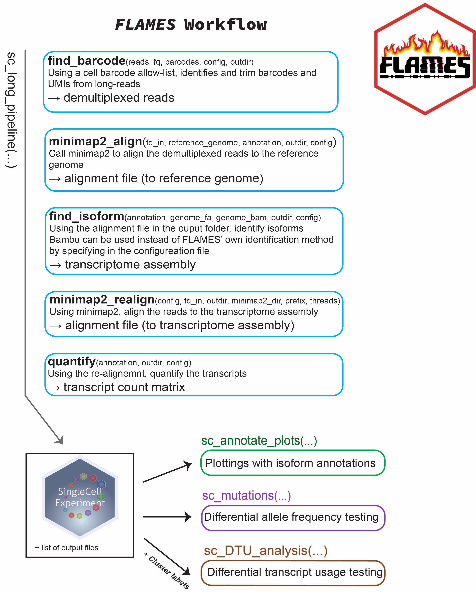

# FLAMES

The FLAMES package provides a framework for performing single-cell and
bulk read full-length analysis of mutations and splicing. FLAMES
performs cell barcode and UMI assignment from nanopore reads as well as
semi-supervised isoform detection and quantification. FLAMES is designed
to be an easy and quick to use, powerful workflow for isoform detection
and quantification, splicing analysis and mutation detection.

Input to FLAMES are fastq files generated from the long-read platform.
Using the cell barcode annotation obtained from short-read data as the
reference, the pipeline identifies and trims cell barcodes/UMI sequences
from the long reads. After barcode assignment, all reads are aligned to
the relevant genome to obtain a draft read alignment. The draft
alignment is then polished and grouped to generate a consensus
transcript assembly. All reads are aligned again using the transcript
assembly as the reference and quantified.

The above figure provides a high level overview of the main steps in the
FLAMES pipeline. The optional arguments on the left are colour coded to
associate with the specific step that they apply to.

## Installation

The Bioconductor release of FLAMES can be installed with:

    if (!require("BiocManager", quietly = TRUE))
        install.packages("BiocManager")

    BiocManager::install("FLAMES")

The latest development version can be installed with:

    if (!require("BiocManager", quietly = TRUE))
        install.packages("BiocManager")
    BiocManager::install("mritchielab/FLAMES")

### ⚠️ Installing source packages inside a conda environment might cause various issues

Please consider using Docker or Singularity instead if you cannot
install FLAMES in your native R environment.

### Docker

    docker pull ghcr.io/mritchielab/flames:20af1ce
    # To start an R session:
    docker run -it ghcr.io/mritchielab/flames:20af1ce
    # Or a bash session:
    docker run -it ghcr.io/mritchielab/flames:20af1ce /bin/bash

### Singularity

    singularity pull flames.sif docker://ghcr.io/mritchielab/flames:20af1ce
    singularity shell -e --writable-tmpfs flames.sif

## Documentation

Function reference manual can be found
[here](https://mritchielab.github.io/FLAMES/reference/index.html).

[IgniteRNAseq](https://github.com/ChangqingW/IgniteRNAseq) is a workflow
package and its rendered vignette can be found
[here](https://changqingw.github.io/IgniteRNAseq/articles/FLAMESWorkflow.html).

A Long read single cell analysis tutorial using both single-sample and
multi-sample modes is available
[here](https://sefi196.github.io/FLAMESv2_LR_sc_tutorial/).

## Common issues

- **basilisk / reticulate errors**\
  If you encounter errors from Python code execution, you could try
  adding `basilisk::setBasiliskFork(FALSE)` before running FLAMES.

- **Isoform identification with bambu** If you encounter errors during
  isoform identification using Bambu, you can try troubleshooting by
  setting the ’‘’bambu_verbose’’’ parameter to TRUE. We have found the
  following steps helpful in resolving issues:

1.  Remove supplementary alignments from the genome BAM file.

2.  Divide the BAM file into smaller sections for easier processing.

3.  Remove unnecessary contigs from the genome.fa file.

4.  Use the HongYhong_fix branch of Bambu, which is better equipped for
    handling large files. You can install this version in R with the
    following command:

&nbsp;

    install_github("GoekeLab/bambu", ref="HongYhong_fix")
